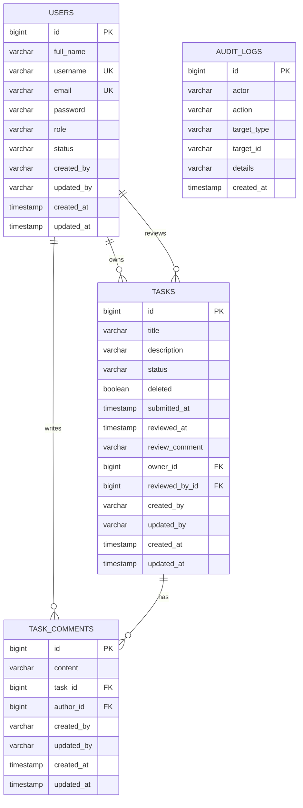

# Database Schema

## ERD



## SQL DDL

```sql
create table users (
    id bigint generated by default as identity primary key,
    full_name varchar(255) not null,
    username varchar(255) not null unique,
    email varchar(255) not null unique,
    password varchar(255) not null,
    role varchar(50) not null,
    status varchar(50) not null,
    created_at timestamp not null,
    updated_at timestamp not null,
    created_by varchar(255) not null,
    updated_by varchar(255) not null
);

create table tasks (
    id bigint generated by default as identity primary key,
    title varchar(255) not null,
    description varchar(2000),
    status varchar(50) not null,
    deleted boolean not null,
    submitted_at timestamp,
    reviewed_at timestamp,
    review_comment varchar(500),
    owner_id bigint not null,
    reviewed_by_id bigint,
    created_at timestamp not null,
    updated_at timestamp not null,
    created_by varchar(255) not null,
    updated_by varchar(255) not null,
    constraint fk_tasks_owner foreign key (owner_id) references users(id),
    constraint fk_tasks_reviewed_by foreign key (reviewed_by_id) references users(id)
);

create table task_comments (
    id bigint generated by default as identity primary key,
    content varchar(1000) not null,
    task_id bigint not null,
    author_id bigint not null,
    created_at timestamp not null,
    updated_at timestamp not null,
    created_by varchar(255) not null,
    updated_by varchar(255) not null,
    constraint fk_task_comments_task foreign key (task_id) references tasks(id),
    constraint fk_task_comments_author foreign key (author_id) references users(id)
);

create table audit_logs (
    id bigint generated by default as identity primary key,
    actor varchar(255) not null,
    action varchar(100) not null,
    target_type varchar(100) not null,
    target_id varchar(100) not null,
    details varchar(1000),
    created_at timestamp not null
);
```

## Notes

- `users.role` supports `USER` and `ADMIN`
- `users.status` supports `ACTIVE` and `INACTIVE`
- `tasks.status` supports `PENDING`, `IN_PROGRESS`, `COMPLETED`, `APPROVED`, `REJECTED`
- soft delete is represented by `tasks.deleted`
- `submitted_at` distinguishes a completed task from a completed-and-submitted task
